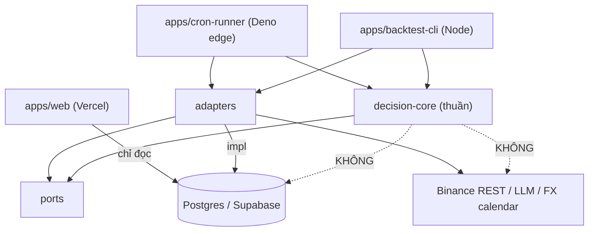
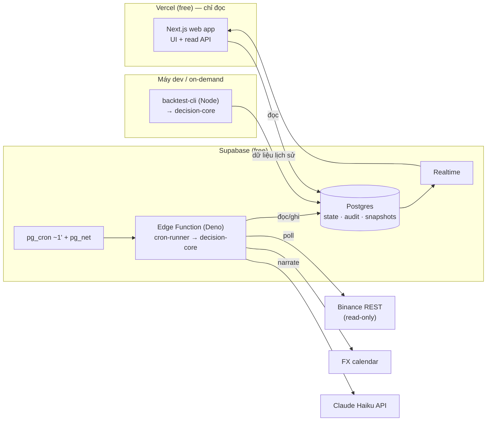
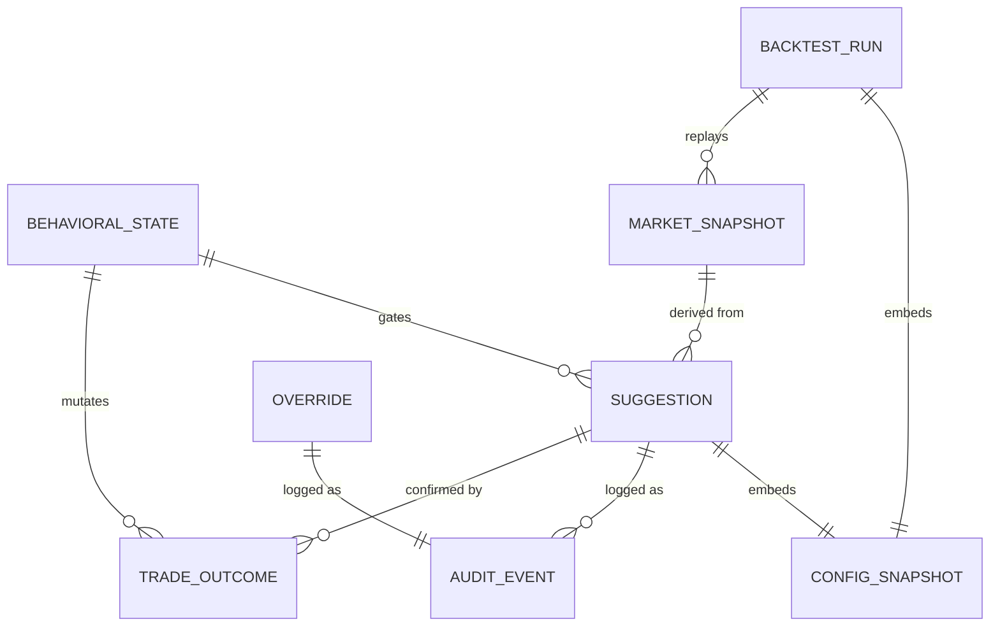

# Architecture Spine — Trading DSS (Brighten v1)

## Design Paradigm

**Hexagonal (ports & adapters)** bọc một **decision-core thuần**; lõi bên trong là **pipes-and-filters** — bốn tầng nối tiếp, mỗi tầng *pass hoặc veto*.

- `decision-core` là hàm thuần: `(market input + state đọc-từ-port) → Đề xuất | im lặng + state-mutation`. Nó **không import IO, không đọc đồng hồ, không random**.
- Mọi tác động ngoài đi qua **port**, hiện thực bởi **adapter**: `ingestion`, `persistence`, `narrator`, `clock`, `ui-read`.
- Nhờ đó **live** và **backtest** chỉ là *hai driver* của cùng một lõi — live bơm snapshot REST, backtest bơm dữ liệu lịch sử.

Ánh xạ layer → namespace (package/thư mục):

| Layer | Thư mục | Được phép phụ thuộc vào |
| --- | --- | --- |
| Core (lõi thuần) | `packages/decision-core/` | *không gì* (chỉ types nội bộ) |
| Ports (interface) | `packages/decision-core/ports/` | core types |
| Adapters | `packages/adapters/` | ports (không phụ thuộc core logic) |
| Drivers | `apps/cron-runner/`, `apps/backtest-cli/` | core + adapters |
| UI | `apps/web/` (Next.js) | **chỉ** persistence-read (Postgres) |

## Invariants & Rules

Hướng phụ thuộc (đây *là* một luật — mũi tên chỉ "được phép phụ thuộc vào"):



### AD-1 — Topology: stateless serverless + Postgres + cron poll
- **Binds:** FR-5, FR-1..4, FR-13; toàn bộ deployment.
- **Prevents:** nhét tiến trình chạy dài vào serverless; state kỷ luật phân tán trong RAM.
- **Rule:** Không có tiến trình always-on trong v1. Pipeline chạy như **scheduled tick (~1 phút)**; mọi state bền nằm ở Postgres. Nếu về sau cần always-on/streaming → thay `ingestion` adapter, **không** đổi cấu trúc này (xem AD-3, AD-11).

### AD-2 — Lõi thuần, tất định
- **Binds:** all; NFR tất định & tái lập.
- **Prevents:** IO/thời gian/ngẫu nhiên rò vào lõi → phá tính tái lập, làm backtest nói dối.
- **Rule:** `decision-core` **cấm** gọi network/disk/clock/random trực tiếp. Thời gian & dữ liệu vào lõi **chỉ** qua port. Cùng `(input, state, config)` → **luôn** cùng output.

### AD-3 — Một engine, hai driver
- **Binds:** FR-8, FR-9; NFR tái lập.
- **Prevents:** hai bản cài đặt "logic live" và "logic backtest" trôi khác nhau.
- **Rule:** Live (cron) và backtest **phải** import *cùng* `decision-core` package. Cấm cài đặt lại bất kỳ luật quyết định nào trong driver. Driver chỉ khác nhau ở adapter (nguồn dữ liệu + clock).

### AD-4 — Config được snapshot cùng mỗi quyết định
- **Binds:** FR-1, FR-4, FR-8, FR-9, FR-11; NFR auditability.
- **Prevents:** một Đề xuất/backtest cũ không thể tái lập vì tham số đã đổi.
- **Rule:** Mọi tham số điều chỉnh-được (cooldown, `win_streak_threshold`, `size_dampening`, `daily_loss_limit`, `min_rr`, risk %, `cost_hurdle_X`, `news_blackout`) là **config có phiên bản**. Mỗi Đề xuất và mỗi `BacktestRun` **lưu kèm snapshot config** đã dùng.

### AD-5 — Thứ tự gating của pipeline
- **Binds:** FR-1, FR-2, FR-3, FR-4, FR-10, FR-11, FR-12.
- **Prevents:** tầng dưới ghi đè quyền phủ quyết của tầng trên; đề xuất ngược hướng; ép setup.
- **Rule:** Thứ tự cố định **Tầng 0 → 1 → 2 → 3**. Tầng 0 có **veto tối cao**. Bất kỳ tầng chặn → dừng ngay, hệ thống **im lặng** (không Đề xuất). Cost-hurdle (FR-11) là cổng trong Tầng 3; live-drift auto-halt (FR-10) & override-friction (FR-12) là luật của Tầng 0. Tầng 2 chỉ tìm điểm vào **theo hướng Tầng 1 cho phép**.

### AD-6 — Một chủ sở hữu cho behavioral state
- **Binds:** FR-1, FR-10, FR-14.
- **Prevents:** hai nơi cùng sửa state kỷ luật → Tầng 0 veto sai.
- **Rule:** Behavioral state (win-streak, daily-loss, cooldown, trade-count) là bản ghi Postgres do **decision-engine** sở hữu, chỉ đổi qua **hai loại event định nghĩa sẵn**: `market-tick` (cron) và `trade-outcome` (feedback). Không component nào khác được mutate. UI **chỉ đọc**.

### AD-7 — Feedback loop hybrid (đóng vòng kết quả lệnh)
- **Binds:** FR-1, FR-10, FR-12, FR-14.
- **Prevents:** Tầng 0 chạy trên state ma vì không biết lệnh thật thắng/thua.
- **Rule:** Kết quả lệnh vào state theo hai nguồn: (a) **Binance read-only API** tự dò vị thế/fill/PnL cho `daily-loss` & `live-drift`; (b) **user xác nhận** fill nào ứng với Đề xuất nào để gắn đúng `win-streak`/R. Khóa API v1 **chỉ đọc**, không bao giờ có quyền đặt lệnh.

### AD-8 — Nhật ký audit append-only
- **Binds:** FR-14; NFR auditability.
- **Prevents:** sửa lịch sử → mất bằng chứng để user tin & tự đối chiếu.
- **Rule:** Mọi Đề xuất, tín hiệu kích hoạt, prompt/response LLM, lần chặn, lần override ghi **append-only, bất biến** (không UPDATE/DELETE). Mỗi bản ghi đủ để tái dựng *vì sao* một Đề xuất xuất hiện hoặc bị chặn.

### AD-9 — LLM narrator nằm ngoài đường quyết định
- **Binds:** FR-7; NFR an-toàn-LLM.
- **Prevents:** LLM tạo/đổi/bỏ một Đề xuất; LLM là điểm chặn.
- **Rule:** LLM chỉ chạy **sau** khi rule đã ra Đề xuất, sau `narrator` port, **temperature thấp**, log toàn bộ prompt/response. Lời giải thích chỉ tham chiếu tín hiệu *đã thực sự kích hoạt*. LLM lỗi → Đề xuất **vẫn hiển thị** (kèm ghi chú thiếu lý do). LLM **không** đọc/ghi state, không nằm trên đường quyết định.

### AD-10 — Vercel cô lập khỏi quyết định & khỏi sàn
- **Binds:** ràng buộc SAFETY (PRD §11); FR-13.
- **Prevents:** một đường code trên UI tự gửi lệnh tới sàn; UI chạy pipeline.
- **Rule:** `apps/web` (Vercel) **chỉ** đọc Postgres + hiển thị + realtime push. Nó **không** chạy pipeline, **không** mutate state, và **không tồn tại** đường code nào từ hệ thống tự gửi lệnh tới sàn trong v1. Người dùng luôn xác nhận thủ công trên sàn.

### AD-11 — Ingestion sau port; suy giảm mềm khi thiếu dữ liệu
- **Binds:** FR-5, FR-6; NFR bền-dữ-liệu.
- **Prevents:** phát Đề xuất trên dữ liệu khuyết; khóa cứng vào cơ chế poll.
- **Rule:** Nguồn dữ liệu ở sau `ingestion` port (v1: Binance REST poll + FX calendar; v2: WS stream = adapter mới). Endpoint lỗi/timeout/thiếu → **suy giảm mềm + ghi log + KHÔNG phát Đề xuất** trên dữ liệu không đủ.

### AD-12 — Suy diễn tín hiệu nằm trong lõi thuần
- **Binds:** FR-2, FR-8, FR-9; NFR tất định.
- **Prevents:** live và backtest suy diễn khác nhau cùng một tín hiệu (vd CVD) → expectancy nói dối.
- **Rule:** Adapter `ingestion` **chỉ giao dữ liệu thô đã chuẩn hóa** (klines + taker volume, funding, OI, L-S ratio). Mọi **suy diễn tín hiệu** (CVD tích luỹ từ taker volume, regime, vùng thanh khoản) nằm trong `decision-core` thuần, nên live-tick và backtest tính **giống hệt**. Adapter không tính chỉ báo.

## Consistency Conventions

| Concern | Convention |
| --- | --- |
| Naming — tầng | `tier0`..`tier3` trong code; "Tầng 0..3" trong UI/nhật ký (tiếng người). |
| Naming — event | Kebab tên miền: `market-tick`, `trade-outcome`, `suggestion-emitted`, `suggestion-blocked`, `override-recorded`. |
| Naming — file/module | Một filter/tầng = một module trong `decision-core/tiers/`; một adapter = một thư mục trong `packages/adapters/`. |
| Tiền tệ / số lượng | Không dùng JS `number` cho tính tiền; giá/khối lượng theo string/decimal của Binance. R & R:R là decimal precision cố định. |
| Thời gian | UTC, epoch-millis ở lưu trữ; timezone chỉ ở lớp hiển thị. Trong lõi, thời gian là input qua `clock` port. |
| Ranh giới "ngày" | `daily_loss_limit`, `max_trades_per_day`, reset chuỗi/đếm đều dựa trên **một mốc trading-day cấu hình được** (mặc định UTC 00:00), lưu trong config (AD-4). Một định nghĩa duy nhất, không mỗi tầng tự chọn. |
| Market snapshot | Shape `MARKET_SNAPSHOT` (đã chuẩn hóa) do `ingestion` adapter **sở hữu**; live-tick ghi và backtest đọc **cùng một shape** — nếu đổi phải version hóa. |
| ID | UUID v7 (sắp theo thời gian) cho `Suggestion`, `AuditEvent`, `BacktestRun`. |
| Config | Bảng `config` có `version`; snapshot nhúng vào `Suggestion.config_snapshot` & `BacktestRun.config_snapshot` (AD-4). |
| Lỗi & log | Lỗi có shape thống nhất `{ code, source, context }`; ingestion lỗi → log + bỏ tick, không throw lên làm chết cron. |
| Secrets | Khóa Binance read-only, LLM key, DB URL ở env/secret store của từng runtime (Supabase Edge secrets, Vercel env, `.env` cho CLI). Không commit. |
| Determinism | Không `Date.now()`/`Math.random()` trong `decision-core` — lint chặn (AD-2). |

## Stack

| Name | Version |
| --- | --- |
| TypeScript | ^5 (lõi + toàn repo) |
| Next.js (UI + read API, trên Vercel) | 16.2.x LTS |
| Node.js (backtest CLI runtime) | 22 LTS |
| Deno (Supabase Edge Functions runtime) | theo nền tảng Supabase |
| Supabase (Postgres 15+, pg_cron, pg_net, Realtime, Edge Functions) | managed |
| Binance API (Spot v3 + Futures, **read-only**) | live docs |
| LLM narrator (behind port, swappable) | Claude Haiku 4.5 (`claude-haiku-4-5`) |
| Lịch tin FX | `[ASSUMPTION]` ForexFactory / investing feed |

## Structural Seed

### Container / deployment view



### Core entities (tên + quan hệ; thuộc tính chi tiết do code sở hữu)



### Source tree (scaffold; code sở hữu chi tiết)

```text
brighten/
  packages/
    decision-core/        # lõi THUẦN — tất định, không IO
      tiers/              # tier0 (hành vi) .. tier3 (risk/sizing)
      ports/              # ingestion · persistence · narrator · clock · ui-read
      types/
    adapters/             # impl port: binance-rest · fx-calendar · postgres · llm-narrator · clock
    config/               # schema + versioning tham số điều chỉnh-được
  apps/
    web/                  # Next.js (Vercel) — CHỈ đọc Postgres + realtime + UI
    cron-runner/          # Supabase Edge Function (Deno) — live tick driver
    backtest-cli/         # Node CLI — offline backtest driver (cùng core)
  supabase/
    migrations/           # schema Postgres + append-only audit + pg_cron job
```

### Deployment & environments

| Môi trường | UI | Pipeline | DB |
| --- | --- | --- | --- |
| Local dev | `next dev` | `backtest-cli` + edge function chạy local (supabase CLI) | Supabase local / branch |
| Prod | Vercel (git deploy) | Supabase Edge Function + pg_cron | Supabase project (free) |

Backtest **không** cần môi trường always-on: chạy on-demand từ CLI (local hoặc job kích hoạt tay).

## Capability → Architecture Map

| Feature / FR | Lives in | Governed by |
| --- | --- | --- |
| FR-1 Tầng 0 phủ quyết | `decision-core/tiers/tier0` + `behavioral-state` | AD-5, AD-6, AD-2 |
| FR-2 Tầng 1 regime/edge | `decision-core/tiers/tier1` | AD-2, AD-5, AD-11 |
| FR-3 Tầng 2 price action | `decision-core/tiers/tier2` | AD-2, AD-5 |
| FR-4 Tầng 3 risk/sizing | `decision-core/tiers/tier3` | AD-2, AD-4 |
| FR-5/6 Nguồn dữ liệu | `adapters/binance-rest`, `adapters/fx-calendar` sau ingestion port | AD-1, AD-11 |
| FR-7 LLM narrator | `adapters/llm-narrator` sau narrator port | AD-9 |
| FR-8/9 Backtest + chống overfit | `apps/backtest-cli` + `decision-core` | AD-3, AD-4 |
| FR-10 Live-drift auto-halt | `decision-core/tiers/tier0` | AD-5, AD-7 |
| FR-11 Cost hurdle | `decision-core/tiers/tier3` (cổng) | AD-4, AD-5 |
| FR-12 Override friction | `decision-core/tiers/tier0` + audit | AD-5, AD-8 |
| FR-13 Trình Đề xuất | `apps/web` (đọc) + realtime | AD-10 |
| FR-14 Nhật ký audit | Postgres append-only + `audit` adapter | AD-8 |

## Deferred

- **Ngưỡng số cụ thể** cho tham số Tầng 0/1/3 (cooldown, `max_trades_per_day`, `win_streak`, `daily_loss_limit`, luật crypto funding/OI/L-S/CVD, `min_rr`, `cost_hurdle_X`) — chốt qua backtest, không phải quyết định kiến trúc. Là **config có phiên bản** (AD-4). *(PRD Open Q1–3, Q7.)*
- **Streaming/always-on (Phương án B)** — chỉ khi v1 chứng minh cần fidelity tick (CVD/orderbook live). Đường lên đã mở qua ingestion port (AD-11); không viết lại lõi.
- **Cơ chế thông báo Đề xuất** (web push / âm thanh / màn hình) — chi tiết UI, khởi điểm: Supabase Realtime → browser + Web Push. *(PRD Open Q5.)*
- **Nguồn & cách lấy lịch tin FX** cụ thể (API trả phí vs scrape) — sau ingestion port, không đổi kiến trúc. *(PRD Open Q6.)*
- **v2**: liquidation heatmap, on-chain flow, LLM đọc-tin→tag & veto một chiều — tất cả là adapter/tầng thêm sau, không đụng lõi.
- **Xác thực người dùng** — solo tool v1; nếu cần, thêm ở lớp UI, không chạm decision-core.
- **Lệnh discretionary (không theo Đề xuất)** — chưa chốt: một lệnh user tự vào ngoài hệ thống có tính vào `win-streak`/`daily-loss`/Tầng 0 không? Là **quyết định sản phẩm + config** (đề xuất mặc định: có tính vào daily-loss/drift vì là rủi ro thật, nhưng không tính win-streak vì không phải "edge của hệ thống"). Không đổi kiến trúc — governed bởi AD-6/AD-7.
